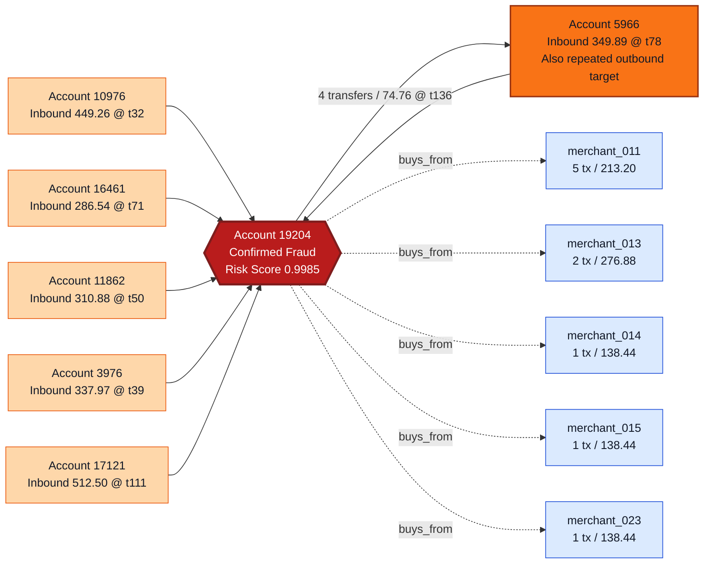
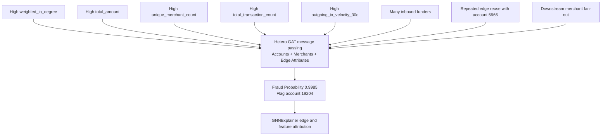

# Real-Time Fraud Scenario

## Purpose

Showcase a concrete, repository-backed fraud scenario using the live Financial Risk Intelligence Engine, with visual graph views of the suspicious account cluster and a step-by-step explanation of how the model identifies the fraud.

This document is not a fictional AML example. It is built from the current archive-derived feature bundle and the live `/explain/19204` API response.

## Scenario Selection

The scenario centers on account `19204`, which is both:

- a confirmed fraud-labeled node in the 20K AMLSim archive
- the current highest-confidence fraud case served by the deployed Hetero GAT API

Repository-backed evidence for this account includes:

- archive fraud label: `is_fraud = 1`
- fraud step: `136`
- live API fraud probability: `0.9985247254371643`

This makes account `19204` an appropriate real-time mule-account case study because the scenario can be described using both ground-truth archive labels and live model behavior.

## Scenario Summary

Account `19204` exhibits the following suspicious pattern:

- it starts with a relatively small initial balance of `138.44`
- it participates in `26` total transactions
- it accumulates `5208.47` of total observed flow
- its `net_outgoing_amount` is `-3397.67`, indicating materially more inbound than outbound value overall
- it receives funds from a distributed set of incoming counterparties
- it repeatedly transfers to account `5966`
- it also fans out into multiple derived merchant buckets

From a mule-account perspective, this is the critical pattern:

- many inbound senders concentrate value into one account
- the account reuses at least one repeated downstream counterparty
- the account also disperses value into a merchant-linked entity surface

That is exactly the kind of spatial-temporal pattern the Hetero GAT was designed to detect.

## Core Account Evidence

The current archive-derived account row for `19204` contains:

| Field | Value |
| :--- | ---: |
| Account ID | `19204` |
| Fraud Label | `1` |
| Fraud Step | `136` |
| Initial Balance | `138.44` |
| Total Transaction Count | `26` |
| Total Amount | `5208.47` |
| Net Outgoing Amount | `-3397.67` |
| Merchant Transaction Count | `10` |
| Merchant Total Amount | `905.40` |
| Unique Merchant Count | `5` |

These values already indicate that the account is not behaving like a quiet, isolated retail node. It is active, connected, and materially involved in inbound concentration and downstream redistribution.

## Counterparty Cluster

### Highest-Value Inbound Counterparties

The strongest observed inbound contributors into account `19204` include:

| Source Account | Amount | Event Time |
| :--- | ---: | ---: |
| `17121` | `512.50` | `111` |
| `10976` | `449.26` | `32` |
| `16783` | `369.45` | `60` |
| `5966` | `349.89` | `78` |
| `3976` | `337.97` | `39` |
| `8751` | `334.10` | `52` |
| `11862` | `310.88` | `50` |
| `17855` | `307.98` | `91` |
| `16461` | `286.54` | `71` |
| `18771` | `229.88` | `95` |

### Outbound Counterparty Reuse

On the outbound side, account `19204` is not distributing evenly across a large random population. The most important repeat transfer path is:

| Target Account | Transfer Count | Total Amount | First Event | Last Event |
| :--- | ---: | ---: | ---: | ---: |
| `5966` | `4` | `74.76` | `136` | `136` |

This repeated reuse of account `5966` matters because it creates a strong structural edge pattern, which is exactly the kind of signal a graph model can exploit more effectively than a flat tabular classifier.

## Connected Entity Layer

The current system also derives merchant-linked entities from outgoing behavior. These merchant nodes are synthetic, archive-derived merchant proxies rather than ground-truth external merchants, but they are still useful for exposing downstream entity fan-out.

The top merchant-linked buckets connected to account `19204` are:

| Derived Merchant ID | Transaction Count | Total Amount | First Event | Last Event |
| :--- | ---: | ---: | ---: | ---: |
| `merchant_011` | `5` | `213.20` | `58` | `136` |
| `merchant_013` | `2` | `276.88` | `69` | `73` |
| `merchant_014` | `1` | `138.44` | `83` | `83` |
| `merchant_015` | `1` | `138.44` | `60` | `60` |
| `merchant_023` | `1` | `138.44` | `54` | `54` |

This is important from an investigation standpoint because the account is not only connected to peer accounts. It also participates in an entity surface that looks like downstream value consumption or redistribution.

## Visual Graph 1: Suspicious Network Around Account 19204



### What This Graph Shows

This graph captures the core mule-style topology:

- a central fraud node receives value from multiple distinct source accounts
- one connected account, `5966`, appears on both sides of the flow pattern
- the central account also disperses into several derived merchant-linked entities

That is a much richer fraud signal than a single suspicious transaction. It is a connected behavioral pattern.

## Visual Graph 2: How The Model Reasons About The Fraud



### Why The Model Flags This Account

The live `/explain/19204` response highlights the current top attributed features as:

| Feature | Attribution Score |
| :--- | ---: |
| `weighted_in_degree` | `0.6628` |
| `total_amount` | `0.6473` |
| `unique_merchant_count` | `0.6194` |
| `incoming_time_span` | `0.6187` |
| `total_transaction_count` | `0.6046` |
| `community_size` | `0.6038` |
| `outgoing_tx_velocity_30d` | `0.6032` |
| `incoming_last_time` | `0.6013` |
| `incoming_transaction_count` | `0.5992` |
| `outgoing_time_span` | `0.5872` |

These features collectively indicate:

- structurally prominent inbound connectivity
- large total monetary flow through the node
- non-trivial downstream entity fan-out
- sustained activity across time rather than one isolated event

## Critical Structural Evidence From The Live Explanation

The current live explanation marks the following transfers among the most influential structural edges in the fraud decision:

| Importance | Transfer | Amount | Event Time |
| ---: | :--- | ---: | ---: |
| `0.6416` | `10976 -> 19204` | `449.26` | `32` |
| `0.6393` | `19204 -> 5966` | `18.69` | `136` |
| `0.6388` | `16461 -> 19204` | `286.54` | `71` |
| `0.6373` | `11862 -> 19204` | `310.88` | `50` |
| `0.6351` | `5966 -> 19204` | `349.89` | `78` |
| `0.6343` | `3976 -> 19204` | `337.97` | `39` |
| `0.6279` | `17855 -> 19204` | `307.98` | `91` |

Two details are especially important:

- the account is not driven by one edge alone; multiple incoming sources matter
- account `5966` is both an upstream and downstream participant, making it a particularly interesting linked account in the suspicious cluster

## Analyst Interpretation

From an operational fraud-investigation perspective, the model is effectively identifying a suspected mule-account concentration pattern.

The reasoning chain is not:

- one large transaction equals fraud

The reasoning chain is:

- one account accumulates funds from multiple unrelated-looking senders
- the account becomes structurally central in the graph
- the account shows enough total flow and enough connected-entity breadth to stand out from the local population
- the account reuses a downstream counterparty and also disperses to merchant-linked entities
- the combined spatial-temporal pattern is consistent with a laundering or mule-style relay node

That is precisely the kind of fraud story a heterogenous graph model is better equipped to detect than a row-wise classifier.

## Readable Markdown Adjacency View

```text
Confirmed fraud node: Account 19204
  Risk score: 0.9985
  Initial balance: 138.44
  Total transaction count: 26
  Total amount observed: 5208.47
  Net outgoing amount: -3397.67

Inbound cluster
  17121 -> 19204 : 512.50 @ t111
  10976 -> 19204 : 449.26 @ t32
  16783 -> 19204 : 369.45 @ t60
  5966  -> 19204 : 349.89 @ t78
  3976  -> 19204 : 337.97 @ t39
  8751  -> 19204 : 334.10 @ t52
  11862 -> 19204 : 310.88 @ t50
  17855 -> 19204 : 307.98 @ t91
  16461 -> 19204 : 286.54 @ t71

Repeated outbound reuse
  19204 -> 5966 : 4 transfers / 74.76 total @ t136

Derived merchant-linked entities
  19204 -> merchant_011 : 5 tx / 213.20
  19204 -> merchant_013 : 2 tx / 276.88
  19204 -> merchant_014 : 1 tx / 138.44
  19204 -> merchant_015 : 1 tx / 138.44
  19204 -> merchant_023 : 1 tx / 138.44
```

## Important Caveat

The merchant nodes shown here are derived merchant proxies created by the repository’s enrichment logic. They should be interpreted as connected entity buckets used to give the model a heterogenous graph surface, not as verified real-world merchant records from AMLSim.

## Summary

This scenario demonstrates how the Financial Risk Intelligence Engine identifies fraud in a live, graph-native setting.

Account `19204` is not flagged because of a single scalar threshold breach on one transaction. It is flagged because the Hetero GAT sees a suspicious network pattern: a fraud-labeled account with concentrated inbound funding, repeated counterparty reuse, multi-entity downstream fan-out, and feature attributions that all align with structurally central mule-style behavior.

That combination of:

- real graph structure
- temporal flow features
- connected entity context
- edge-level explanation

is what turns the repository from a conventional fraud classifier into a fraud-intelligence engine.