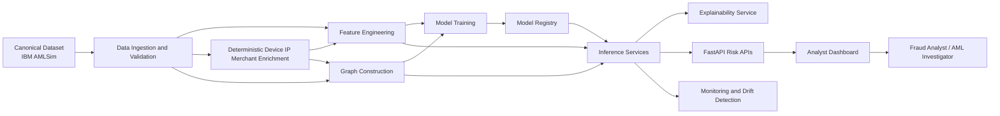
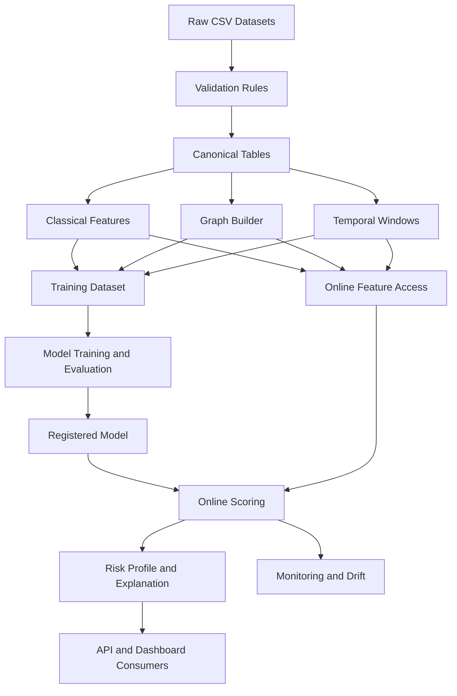
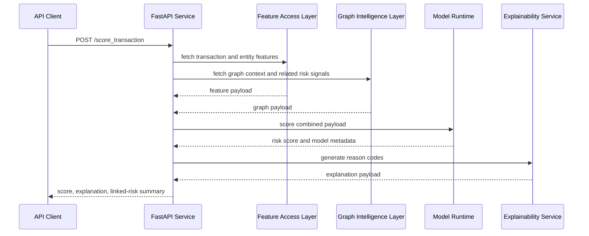

# Architecture Vision

## Purpose

Define the target system architecture for a financial risk intelligence platform that combines classical ML, graph analytics, temporal modelling, explainability and production APIs.

## Architecture Goals

1. Separate offline training concerns from online inference concerns.
2. Support both entity-centric and transaction-centric risk views.
3. Keep graph intelligence, temporal intelligence and explainability as composable services.
4. Preserve reproducibility, observability and deployment simplicity.

## System Context

## Logical Layers

### 1. Data Ingestion Layer

- loads raw source files
- standardizes schema and identifiers
- validates field completeness and data types
- materializes source-native canonical entities before derived enrichment

### 1a. Deterministic Enrichment Layer

- derives Device, IP Address and Merchant entities from repeatable seeded rules
- records lineage so derived entities remain distinguishable from source-native AMLSim data
- preserves reproducibility across graph and feature experiments

### 2. Feature Engineering Layer

- computes customer, merchant, device and temporal aggregates
- enforces time-aware feature windows
- writes offline feature sets for training and evaluation

### 3. Graph Intelligence Layer

- constructs graph nodes and edges from normalized entity relationships
- computes graph features, communities and embeddings
- supplies graph-derived signals to model training and inference

### 4. Model Training Layer

- trains baseline, hybrid and graph-aware models
- tracks experiments, metrics and artifacts
- registers candidate models for serving

### 5. Inference Layer

- accepts transaction or customer scoring requests
- assembles required features and graph context
- produces scores, reason codes and risk profile payloads

### 6. Monitoring Layer

- tracks data drift, feature drift, prediction drift and API latency
- records alert volumes and scoring failures
- supports operational triage

### 7. Dashboard Layer

- provides fraud investigation views
- supports graph exploration and explanation review
- surfaces executive metrics and model health summaries

## Core Data Domains

| Domain | Description | Key Examples |
| --- | --- | --- |
| Party | Human or legal entity being assessed | party_id, party_type, geography, profile attributes |
| Account | Financial account used for transfers or holdings | account_id, account_type, status |
| Transaction | Monetary event to score or analyze | transaction_id, amount, timestamp |
| Alert | Suspicious pattern grouping or labeled investigative case | alert_id, alert_type, alert_membership |
| Bank | Financial institution boundary for accounts | bank_id, branch identifiers |
| Device (Derived) | Synthetic device fingerprint or access endpoint generated for MVP graph coverage | device_id, shared account count |
| Merchant (Derived) | Synthetic counterparty or merchant generated for MVP graph coverage | merchant_id, merchant risk ratio |
| IP Address (Derived) | Synthetic network source generated for MVP infrastructure linkage | ip_id, geolocation, reuse count |

## Proposed Runtime Components

| Component | Responsibility |
| --- | --- |
| ingestion job | read raw datasets, normalize and validate |
| feature job | generate offline and reusable feature tables |
| graph job | materialize graph structure, graph metrics and embeddings |
| training pipeline | train, evaluate and register models |
| feature access layer | retrieve scored entity context for APIs |
| risk scoring service | execute online inference and score normalization |
| explainability service | generate SHAP summaries, top factors and reason codes |
| monitoring service | compute drift and operational health metrics |
| analyst dashboard | provide transaction, entity and graph investigation views |

## Reference Data Flow

## Scoring Sequence

## Deployment View

For the initial project release:

- FastAPI serves inference endpoints
- PostgreSQL stores curated tables, features or scoring outputs where useful
- Docker packages API and supporting services
- MLflow tracks experiments and model versions
- Streamlit provides analyst and executive dashboards

Future extension options:

- dedicated feature store
- Neo4j-backed graph exploration
- asynchronous scoring or batch pipelines
- cloud deployment with scheduled retraining

## Security And Compliance Considerations

- avoid storing unnecessary sensitive fields in example datasets
- log model inputs and outputs carefully to avoid leaking private information
- define access separation between analyst-facing and admin-facing views
- retain explainability artifacts for model governance review

## Architectural Decisions To Lock Early

1. canonical entity identifiers across datasets
2. time-aware split strategy for all supervised experiments
3. deterministic enrichment rules and seeds for Device, IP Address and Merchant entities
4. whether graph storage is file-based, in-memory or Neo4j-backed for MVP
5. offline versus near-real-time feature generation for API scoring
6. risk score normalization strategy across supervised and unsupervised outputs

## Non-Goals For MVP Architecture

- multi-region active-active deployment
- full event-stream ingestion from live payment rails
- enterprise IAM integration
- human case-management system integration

## Immediate Next Documents

The next architecture-adjacent documents should be:

1. fraud taxonomy and entity relationship mapping
2. data dictionary and validation specification
3. API specification and monitoring plan