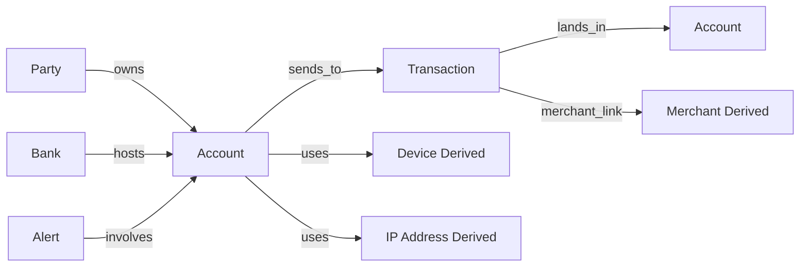

# Entity Relationship Mapping

## Purpose

Define the canonical entity model that maps IBM AMLSim outputs into the Financial Risk Intelligence Platform and makes derived MVP entities explicit.

## Mapping Strategy

1. Treat IBM AMLSim accounts, transactions, alerts, parties and banks as source-native entities when the files exist.
2. Use the bundled sample outputs as a fallback layout for immediate implementation.
3. Introduce Device, IP Address and Merchant as deterministic derived entities in the processed layer.
4. Preserve lineage so every processed field can be traced to either source-native AMLSim data or deterministic enrichment.

## Source-Native AMLSim Entities

| Canonical Entity | Primary Source Files | Key Fields |
| --- | --- | --- |
| Party | `individuals-bulkload.csv`, `organizations-bulkload.csv`, `accountMapping.csv`; sample fallback from `PRIMARY_CUSTOMER_ID` | `party_id`, `party_type`, names, geography |
| Account | `accounts.csv` | `acct_id`, `bank_id`, `initial_deposit`, `open_dt`, `close_dt`, `tx_behavior_id` |
| Transaction | `transactions.csv`; sample fallback `tx.csv` | `tran_id`, `orig_acct`, `bene_acct`, `tx_type`, `base_amt`, `tran_timestamp` |
| Cash Transaction | `cash_tx.csv` | account cash in/out activity |
| Alert | `alert_accounts.csv`, `alert_transactions.csv`; sample fallback `alerts.csv` | `alert_id`, `alert_type`, `acct_id`, `is_sar`, timestamps |
| Bank | `bank_id` fields in account and alert members | institution boundary |
| Resolved Entity Link | `resolvedentities.csv` | entity-resolution relationships between parties |

## Derived MVP Entities

| Canonical Entity | Derivation Rule | Why It Exists |
| --- | --- | --- |
| Device | deterministic assignment from account identifiers and enrichment seed | support shared-device graph edges and takeover-style signals |
| IP Address | deterministic assignment from account identifiers and enrichment seed | support shared-IP graph edges and infrastructure reuse features |
| Merchant | deterministic assignment from destination account and transaction type | support counterparty clustering and merchant-style concentration features |

## Canonical Processed Tables

The processed layer should materialize these tables:

| Table | Status | Purpose |
| --- | --- | --- |
| `parties.csv` | source-native when possible, fallback-derived in sample mode | account owner or legal entity representation |
| `accounts.csv` | source-native normalized | core account entity with alert flags |
| `transactions.csv` | source-native normalized | directed money movement edges |
| `alerts.csv` | source-native normalized | suspicious pattern membership and alert metadata |
| `banks.csv` | source-native normalized | institution boundary table |
| `devices.csv` | derived | synthetic infrastructure node table |
| `ip_addresses.csv` | derived | synthetic infrastructure node table |
| `merchants.csv` | derived | synthetic counterparty grouping node table |
| `account_device_links.csv` | derived | account-to-device relationships |
| `account_ip_links.csv` | derived | account-to-IP relationships |
| `transaction_merchant_links.csv` | derived | transaction-to-merchant relationships |

## Canonical Field Mapping

### Sample Layout To Canonical Fields

| Sample Field | Canonical Field | Notes |
| --- | --- | --- |
| `ACCOUNT_ID` | `account_id` | account primary key |
| `PRIMARY_CUSTOMER_ID` | `party_id` | fallback party identifier in sample mode |
| `init_balance` | `initial_balance` | starting balance |
| `country` | `country_code` | geography |
| `business` | `business_type` | coarse business label |
| `TXN_ID` | `transaction_id` | transaction primary key |
| `COUNTER_PARTY_ACCOUNT_NUM` | `destination_account_id` | destination account in sample transactions |
| `TXN_SOURCE_TYPE_CODE` | `transaction_type` | transfer or cash event code |
| `TXN_AMOUNT_ORIG` | `amount` | transaction amount |
| `start` or `RUN_DATE` | `event_step` | temporal event index |
| `ALERT_KEY` | `alert_id` | alert primary key |
| `CHECK_NAME` | `alert_type` | cycle or typology name |

### Full Converted Layout To Canonical Fields

| Full Field | Canonical Field | Notes |
| --- | --- | --- |
| `acct_id` | `account_id` | account primary key |
| `partyId` or `cust_id` | `party_id` | from party exports or account mapping |
| `tran_id` | `transaction_id` | transaction primary key |
| `orig_acct` | `source_account_id` | source account |
| `bene_acct` | `destination_account_id` | beneficiary account |
| `tran_timestamp` | `event_timestamp` | timestamp for rolling features |
| `alert_id` | `alert_id` | alert membership key |
| `is_sar` | `is_sar` | suspicious alert label |
| `bank_id` | `bank_id` | institution boundary |

## Relationship Model

## Cardinality Rules

| Relationship | Cardinality | Notes |
| --- | --- | --- |
| Party to Account | one-to-many | sample mode assumes one primary party per account |
| Bank to Account | one-to-many | bank boundaries come from `bank_id` |
| Account to Transaction as source | one-to-many | directed outgoing edges |
| Account to Transaction as destination | one-to-many | directed incoming edges |
| Alert to Account | one-to-many | one alert can involve multiple accounts |
| Account to Device | many-to-one in first MVP | deterministic device sharing intentionally creates linked neighborhoods |
| Account to IP Address | many-to-one in first MVP | deterministic IP sharing intentionally creates linked neighborhoods |
| Transaction to Merchant | many-to-one | derived merchant cluster per transaction |

## Graph Edge Semantics

| Edge | Source | Direction | Weight Candidates |
| --- | --- | --- | --- |
| `account_transfers_to_account` | source-native transaction | directed | amount, count, first_step, last_step |
| `party_owns_account` | source-native mapping or sample fallback | directed | ownership_role |
| `bank_hosts_account` | source-native bank assignment | directed | none |
| `account_uses_device` | derived | undirected or directed | assignment_count |
| `account_uses_ip` | derived | undirected or directed | assignment_count |
| `transaction_links_to_merchant` | derived | directed | merchant_frequency |
| `alert_involves_account` | source-native alert membership | directed | is_sar |

## Label Strategy For The First Slice

### Account Or Party Risk Label

- positive when the account or linked party appears in normalized alerts
- used for account/customer baseline modelling

### Transaction Risk Label

- direct positive when `alert_transactions.csv` exists and includes the transaction
- fallback positive in sample mode when the transaction is alert-adjacent through source or destination account membership
- fallback labels must be documented as proxy labels in evaluation reports

## Derived Entity Lineage Rules

1. Every derived table must include `source_type = derived`.
2. Derived identifiers must be deterministic from account or transaction identifiers and a fixed enrichment seed.
3. Derived tables must never overwrite source-native AMLSim fields.
4. Source-native and derived entities must remain joinable through explicit link tables.

## Implementation Consequences

1. Loaders must discover whether they are reading the legacy sample layout or the full converted layout.
2. Canonical normalization must support both layouts without changing processed table names.
3. Feature engineering should operate only on canonical tables, not directly on raw AMLSim file names.
4. Graph construction should use transaction edges plus derived infrastructure edges from the beginning so the project can support fraud rings and infrastructure-based linking together.

## Acceptance Criteria

- every canonical table has an identified source or derivation path
- sample-layout and full-layout field mappings are both documented
- derived entities are explicit and lineage-safe
- label strategy for transaction and account/customer scoring is defined before baseline training