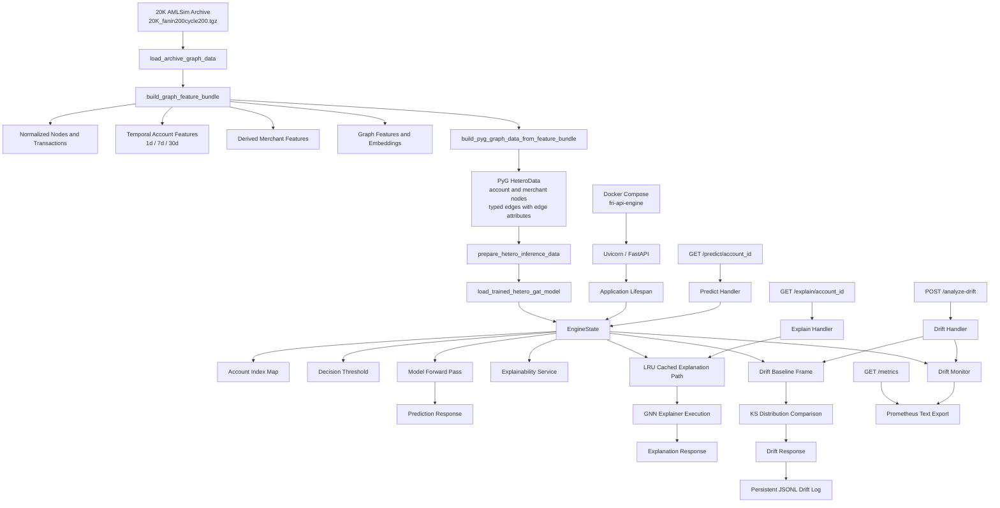

# System Architecture

## Purpose

Document the deployed architecture of the Financial Risk Intelligence Engine as it exists in the repository today, from AMLSim archive ingestion through model serving, explanation, drift detection, and operational telemetry.

## High-Level Overview

The Financial Risk Intelligence Engine is a real-time anti-money-laundering fraud detection platform built around a heterogenous graph neural network and served through a containerized FastAPI application.

At runtime, the system does not behave like a loose collection of disconnected research scripts. It behaves as a single, stateful inference engine that:

- loads the unified 20K AMLSim archive sample
- derives graph, temporal, and merchant-enriched features from that archive
- materializes a PyTorch Geometric heterogenous graph
- loads a trained Hetero GAT checkpoint
- serves prediction and explanation requests over HTTP
- monitors feature-distribution drift and exports operational metrics

The active deployment shape is a single containerized API service named `fri-api-engine`, exposed on port `8000` through Docker Compose.

## Architectural Scope

The serving boundary is defined by the following repository surfaces:

- [Dockerfile](Dockerfile)
- [docker-compose.yml](docker-compose.yml)
- [configs/default.yaml](configs/default.yaml)
- [src/fri/api/](src/fri/api/)
- [src/fri/graph/](src/fri/graph/)
- [src/fri/models/pytorch_gnn.py](src/fri/models/pytorch_gnn.py)
- [src/fri/temporal/drift.py](src/fri/temporal/drift.py)

Those components together form a production-style runtime that packages the trained model, the archive-derived feature pipeline, the API contract, and the MLOps monitoring layer into one deployable unit.

## Deployment Topology

### Docker Compose Layer

[docker-compose.yml](docker-compose.yml) defines one network-facing service:

- service name: `fri-api-engine`
- build context: repository root
- published port: `8000:8000`
- bind mount: `./artifacts:/app/artifacts`
- restart policy: `unless-stopped`

This means the current production boundary is intentionally simple: one API container, one published port, and one persisted artifact volume.

### Container Runtime Layer

[Dockerfile](Dockerfile) builds the service on top of `python:3.11-slim` and sets:

- `PYTHONDONTWRITEBYTECODE=1`
- `PYTHONUNBUFFERED=1`
- `PYTHONPATH=/app/src`

It installs the CPU-oriented PyTorch runtime, installs the pinned serving dependencies, and copies:

- [src/](src/)
- [configs/](configs/)
- [data/](data/)
- [artifacts/](artifacts/)

The image exposes port `8000` and starts the API with:

```bash
uvicorn fri.api.main:app --host 0.0.0.0 --port 8000
```

It also declares a health check against `GET /health`, which allows the container runtime to distinguish between process start and actual application readiness.

## Component Layout

The end-to-end system flow is anchored on a unified archive-to-graph-to-inference pipeline.

### 1. Unified 20K AMLSim Archive

The serving engine loads the archive configured in [configs/default.yaml](configs/default.yaml):

- [data/external/AMLSim/sample/20K_fanin200cycle200.tgz](data/external/AMLSim/sample/20K_fanin200cycle200.tgz)

[src/fri/graph/io.py](src/fri/graph/io.py) extracts the metadata, nodes, and transaction files.

This archive is the canonical runtime data source for the current model-serving path.

### 2. Feature Engineering Layer

[src/fri/graph/service.py](src/fri/graph/service.py) builds a unified feature bundle directly from the archive tables.

That bundle includes:

- normalized account nodes
- normalized account-to-account transactions
- account temporal velocity features over 1-day, 7-day, and 30-day windows
- derived merchant entities and merchant temporal features
- graph-analytic node features
- optional spectral embeddings

This feature bundle is deliberately shared across the broader modeling stack so the deployed GNN, baselines, and drift monitoring all originate from the same underlying archive-derived representations.

### 3. PyTorch Geometric Graph Layer

[src/fri/models/pytorch_gnn.py](src/fri/models/pytorch_gnn.py) converts the feature bundle into a `HeteroData` graph with two node types:

- `account`
- `merchant`

and three typed edge relations:

- `account -> transfers -> account`
- `account -> buys_from -> merchant`
- `merchant -> rev_buys_from -> account`

Each edge carries structured attributes:

- `amount`
- `event_time`
- `transaction_type_code`

This makes the deployed inference graph explicitly spatial-temporal and heterogenous rather than a flat tabular matrix.

### 4. Model Layer

The serving model is `SpatialTemporalHeteroGAT`, implemented in [src/fri/models/pytorch_gnn.py](src/fri/models/pytorch_gnn.py).

The engine reconstructs that model from:

- the heterogenous graph shape
- the graph metrics artifact at [artifacts/graph/pytorch_gcn_metrics.json](artifacts/graph/pytorch_gcn_metrics.json)
- the trained checkpoint file under the [artifacts/graph/](artifacts/graph/) directory.

The model is loaded once during application startup and then held in memory for all subsequent requests.

### 5. API Layer

[src/fri/api/main.py](src/fri/api/main.py) exposes the serving contract:

- `GET /health`
- `GET /predict/{account_id}`
- `GET /explain/{account_id}`
- `POST /analyze-drift`
- `GET /metrics`

This API layer is intentionally thin. It delegates almost all meaningful runtime work to `EngineState`.

### 6. MLOps Layer

The operational monitoring layer currently includes:

- baseline feature-distribution storage in memory
- KS-based drift analysis over incoming payloads
- persistent JSONL drift event logging under [artifacts/temporal/drift_events.jsonl](artifacts/temporal/drift_events.jsonl)
- Prometheus-style metrics export via `GET /metrics`

This means the serving plane and monitoring plane are currently co-located inside the same containerized service.

## Microservices And State Management

### FastAPI Lifespan Initialization

FastAPI uses a lifespan context manager to call `initialize_engine()` once when the application starts.

That startup path creates a singleton `EngineState`, which owns the entire live serving state of the system.

### What `EngineState` Holds

`EngineState` centralizes:

- repository settings
- resolved runtime device
- loaded graph metrics artifact
- archive-derived feature bundle
- prepared heterogenous inference graph
- loaded Hetero GAT checkpoint
- account ID to node-index mapping
- decision threshold
- drift baseline frame
- drift monitor
- explainability service

This is the critical runtime abstraction in the repository. The FastAPI route handlers do not rebuild features, reload model weights, or reconstruct the graph on each request. They query this already-materialized in-memory state.

### Why The State Model Matters

The design is intentionally startup-heavy and request-light.

That yields three direct benefits:

- prediction requests avoid model and graph reload overhead
- explanation requests reuse the live model and graph tensors
- drift requests compare incoming data against a preloaded baseline frame rather than recomputing a reference distribution

This is the architectural reason the API can provide relatively fast steady-state behavior even though the underlying model and graph construction path are non-trivial.

## LRU Caching And High-Speed Inference

The highest-cost online path is explanation, not prediction.

`EngineState` uses `@lru_cache(maxsize=128)` on `_explain_account_cached(...)`, keyed by:

- `account_id`
- explainer epoch budget

The implication is:

- repeated explanations for the same account can return from memory
- repeated analyst queries avoid rerunning the explainer

For prediction, speed comes from a different mechanism: the model and heterogenous graph are already in memory, so `predict_account(...)` only needs to map the external account ID, execute a forward pass, and compare the resulting probability to the stored threshold.

In other words:

- prediction speed is achieved by preloaded model state
- explanation speed is improved further through explicit LRU caching

## Request Pipeline Details

### Prediction Request Flow

For `GET /predict/{account_id}`:

1. FastAPI resolves the request into the `predict()` handler.
2. The handler retrieves the singleton via `get_engine_state()`.
3. `EngineState.predict_account()` maps the external account ID to the graph index.
4. The model runs inference over the prepared heterogenous graph.
5. The returned fraud probability is compared against the stored decision threshold.
6. A structured prediction response is returned.

### Explanation Request Flow

For `GET /explain/{account_id}`:

1. FastAPI resolves the request into the `explain()` handler.
2. The handler calls `EngineState.explain_account(account_id, epochs=50)`.
3. The call first checks the LRU cache.
4. On a cache miss, the heterogenous explainer runs against the in-memory model and graph.
5. A structured explanation response is returned with feature and critical-transaction evidence.

### Drift Request Flow

For `POST /analyze-drift`:

1. FastAPI receives a list of recent numeric feature dictionaries.
2. `EngineState.analyze_drift()` converts the payload into a frame.
3. The payload is compared against the stored baseline account-feature frame using KS-based distribution checks.
4. A drift result is produced.
5. The event is persisted to [artifacts/temporal/drift_events.jsonl](artifacts/temporal/drift_events.jsonl).
6. Prometheus counters, gauges, and latency metrics are updated.
7. A structured drift report is returned.

### Metrics Request Flow

For `GET /metrics`:

1. FastAPI calls `engine.metrics_payload()`.
2. The monitoring registry renders Prometheus text format.
3. The metrics payload is returned directly to the caller.

## Mermaid Flowchart



## Readable Markdown Flowchart

```text
20K AMLSim Archive (.tgz)
  -> load_archive_graph_data()
  -> build_graph_feature_bundle()
     -> normalized nodes and transactions
     -> temporal account features (1d / 7d / 30d)
     -> derived merchant features
     -> graph features and embeddings
  -> build_pyg_graph_data_from_feature_bundle()
  -> PyTorch Geometric HeteroData
  -> prepare_hetero_inference_data()
  -> load_trained_hetero_gat_model()
  -> EngineState singleton
     -> account ID lookup map
     -> decision threshold
     -> drift baseline frame
     -> explanation service
     -> drift monitor
     -> LRU-cached explanation path

Docker Compose
  -> fri-api-engine container
  -> uvicorn fri.api.main:app
  -> FastAPI lifespan initializes EngineState once

Runtime request paths
  -> GET /predict/{account_id}
     -> EngineState.predict_account()
     -> model forward pass
     -> fraud probability response

  -> GET /explain/{account_id}
     -> EngineState.explain_account(...)
     -> LRU cache check
     -> explainer execution on cache miss
     -> feature and critical-edge response

  -> POST /analyze-drift
     -> EngineState.analyze_drift()
     -> KS-based baseline-vs-recent comparison
     -> drift response
     -> append event to artifacts/temporal/drift_events.jsonl
     -> update Prometheus metrics registry

  -> GET /metrics
     -> Prometheus text payload
```

## Operational Characteristics

The implemented architecture has several important engineering properties:

- single-service deployment model
  The current runtime is one containerized FastAPI service rather than a distributed service mesh.

- shared data lineage
  Ingestion, feature engineering, model serving, explanation, and drift analysis all derive from the same 20K archive source.

- startup-paid complexity
  Expensive graph construction and checkpoint loading are paid during startup rather than per request.

- in-process monitoring
  Drift detection, event logging, and metrics export are attached directly to the live serving state.

- artifact-aware persistence
  The Docker Compose artifact mount ensures drift logs and other runtime outputs remain available on the host after container restarts.

## Summary

The Financial Risk Intelligence Engine has evolved into a stateful, containerized inference platform that integrates archive ingestion, feature engineering, heterogenous graph inference, explanation, and drift monitoring behind a single HTTP boundary.

Its architectural center of gravity is `EngineState`: a singleton runtime object that holds the live graph, the trained Hetero GAT model, the decision threshold, the explainability service, and the drift-monitoring baseline. That design is what makes the system operationally simple while still supporting real-time scoring, cached explanation reuse, and MLOps telemetry from the same deployed service.